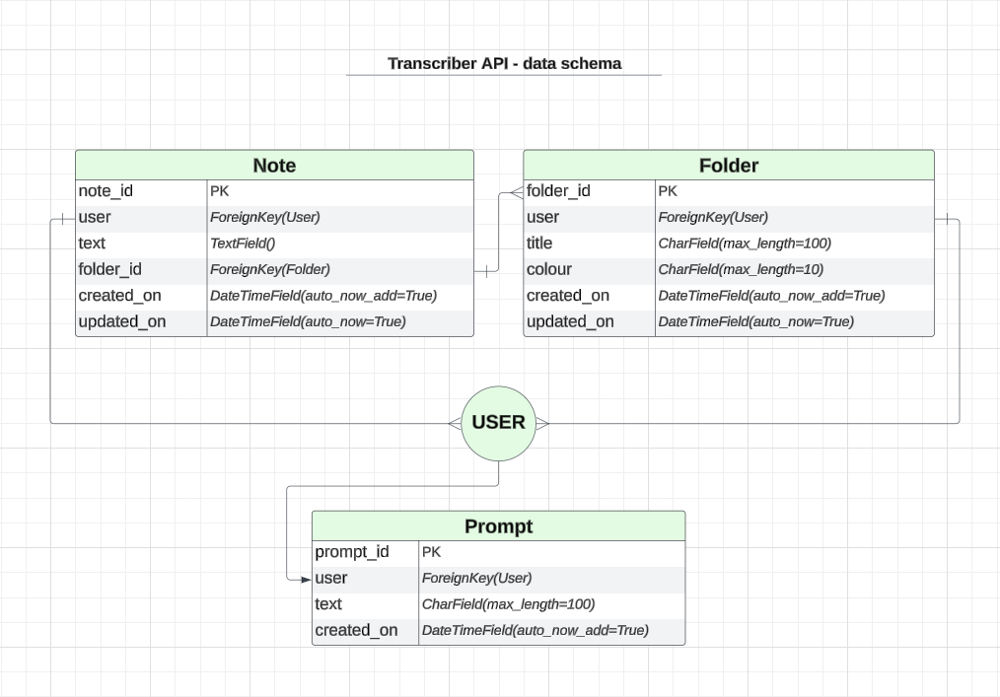

# Transcriber - backend

This is the backend API for the frontend application **Transcriber**.

- View the live frontend site [here](https://transcriber-frontend-9c6d6be53f14.herokuapp.com/).
- View the frontend repo [here](https://github.com/timgoalen/transcriber-frontend).

## About

**Transcriber - backend** is a REST API built with the Django REST Framework.

View the API [here](https://transcriber-backend-api-22aee3c5fb11.herokuapp.com/).

### Project Goals

The goals for the site’s functionality were:

- To create an API that will communicate with the React frontend application and save data to a PostgreSQL database.

## Agile Development

A Kanban board in Github projects was used for the Agile development process - see the board [here](https://github.com/users/timgoalen/projects/5).

‘Epics’ were broken down into ‘User Stories’, which were further broken down into ‘Tasks’.

## Data Schema



## Features to Implement in the Future

- Save `notes.text` as an encrypted field, using a 3rd party library like Django Encrypted Model Fields, so users' notes are unreadable in the Django admin dashboard.

## Technologies Used

- Language:
    - Python
- Framework:
    - Django
- Database:
    - PostgreSQL
- [Visual Studio Code](https://code.visualstudio.com/) - as the code editor.
- [Git](https://git-scm.com/) - for version control, using the Gitpod IDE.
- [GitHub](https://github.com/) - for storing the project.
- [ElephantSQL](https://www.elephantsql.com/) - PostgreSQL as a service.
- [Heroku](https://www.heroku.com/) - to deploy the application.
- [Lucidchart](https://www.lucidchart.com/pages/) - to create the database schema diagrams.
- [Code Institute’s Python Linter](https://pep8ci.herokuapp.com/) - for automated testing of the Python code.
- [Postman](https://www.postman.com/) - to test the API endpoints.

### Python Packages Used

- [djangorestframework](https://www.django-rest-framework.org/) - to to build the REST API in Django.
- [django-allauth](https://docs.allauth.org/en/latest/index.html) - for user authentication.
- [dj-rest-auth](https://dj-rest-auth.readthedocs.io/en/latest/) - for user registration and authentication using the REST API.
- [django-cors-headers](https://pypi.org/project/django-cors-headers/) - to allow in-browser requests to the Django backend.
- [psycopg2](https://pypi.org/project/psycopg2/) - as the PostgreSQL database adapter for Python.
- [dj_database_url](https://pypi.org/project/dj-database-url/) - to allow the use of the `DATABASE_URL` environment variable inside Django.
- [whitenoise](https://whitenoise.readthedocs.io/en/stable/index.html)- to host the static files for the Heroku deployment.
- [gunicorn](https://gunicorn.org/) - as the HTTP server that allows Django to run on Heroku.

## Testing

### Automated Testing

**Python Linting**

Python linting was carried out with [Code Institute’s Python Linter](https://pep8ci.herokuapp.com/).

There were no errors left in the production code. A few ‘line is too long’ errors were corrected.

### Manual Testing - Postman

I used [Postman](https://www.postman.com/) during development to manually test all of the API endpoints, and to test that only the owner of the data can access it.

CRUD testing:

| App | Action | Result |
| --- | --- | --- |
| Notes | CREATE | PASS |
| Notes | READ | PASS |
| Notes | UPDATE note.text | PASS |
| Notes | UPDATE note.folder_id | PASS |
| Notes | DELETE | PASS |
| Folders | CREATE | PASS |
| Folders | READ | PASS |
| Folders | UPDATE folder.title | PASS |
| Folders | DELETE | PASS |
| Users | CREATE | PASS |
| Users | READ | PASS |
| Prompts | CREATE | PASS |
| Prompts | READ | PASS |
| Prompts | DELETE | PASS |

### User Stories Testing

All user stories were tested to confirm that they meet their Acceptance Criteria. The following have all PASSED.

(View the EPICS, User Stories, Acceptance Criteria and Tasks on the GitHub [Kanban Board](https://github.com/users/timgoalen/projects/5)).

---

EPIC: USER ACCOUNTS

---

As a **user** I can s**ign up & log In** so that **I can use the application**.

- Acceptance Criteria - PASSED:
    - Users can sign up via a form
    - Users can log in via a form
    - Form inputs are validated
    - Form errors are communicated to the user
    - The log in status is made clear to the user via on screen messages and UI state

---

As a **user** I can **log out of my account** so that **my data doesn't appear when other use the device**.

- Acceptance Criteria - PASSED:
    - A log out button.
    - Log out status is clearly communicated to the user.
    - The users save state (notes, folder & prompts) is not shown in the UI after logging out.

---

EPIC: NOTES

---

As a **user** I can **create a note** so that **I can read it at a later date or on a different device**.

- Acceptance Criteria - PASSED:
    - User can create a note
    - User can view a list of their notes
    - User can edit a note
    - User can delete a note
    - Only a user can access or modify their own notes

---

EPIC: FOLDERS

---

As a **user** I can **save, edit and delete my folders** so that **I can retrieve and manage my folders**.

- Acceptance Criteria - PASSED:
    - User can create a folder
    - User can view a list of their folder
    - User can edit a folder
    - User can delete a folder
    - Only a user can access or modify their own folder

---

EPIC: PROMPTS

---

As a **user** I can **save and delete custom prompt** so that **I can use custom AI formatting**.

- Acceptance Criteria - PASSED:
    - User can create a custom prompt
    - User can view a list of their prompts
    - User can delete a prompt
    - Only a user can access or modify their own prompts

---

EPIC: DEPLOYMENT

---

As a **developer** I can **deploy my application** so that **the frontend application can save data via an API**.

- Acceptance Criteria - PASSED:
    - Deployed to Heroku
    - Private variables are not shared in GitHub repository

---

## Deployment

### Forking the GitHub Repository

By forking the GitHub Repository we make a copy of the original repository on our GitHub account to view and/or make changes without affecting the original repository by using the following steps...

1. Log in to GitHub and locate the [GitHub Repository](https://github.com/timgoalen/command-line-coffee)
2. At the top right of the Repository, just below the GitHub navbar, click on the "Fork" Button.
3. You should now have a copy of the original repository in your GitHub account.

### Making a Local Clone

1. Log in to GitHub and locate the [GitHub Repository](https://github.com/timgoalen/command-line-coffee)
2. Above the list of files, click "Code".
3. To clone the repository using HTTPS, under "Clone with HTTPS", copy the link.
4. Open Git Bash
5. Change the current working directory to the location where you want the cloned directory to be made.
6. Type `git clone`, and then paste the URL you copied in Step 3.

```
$ git clone https://github.com/YOUR-USERNAME/YOUR-REPOSITORY

```

1. Press Enter. Your local clone will be created.

```
$ git clone https://github.com/YOUR-USERNAME/YOUR-REPOSITORY
> Cloning into `CI-Clone`...
> remote: Counting objects: 10, done.
> remote: Compressing objects: 100% (8/8), done.
> remove: Total 10 (delta 1), reused 10 (delta 1)
> Unpacking objects: 100% (10/10), done.

```

Click [Here](https://help.github.com/en/github/creating-cloning-and-archiving-repositories/cloning-a-repository#cloning-a-repository-to-github-desktop) to retrieve pictures for some of the buttons and more detailed explanations of the above process.

1. For changes you've made to reflect on the live site*:
    - Type `git add <files changed>`
    - Type `git commit -m <description of change>`
    - Type `git push`
    - In Heroku, after pushing to Github - if 'automatic deploys' aren't enabled, manually deploy by clicking 'Deploy Branch' in the Manual Deploy section.

### ElephantSQL

1. Create an [ElephantSQL](https://www.elephantsql.com/) account.
2. Create a new instance.
3. Copy the database URL.

You will also need to add the database to your Django [settings.py](http://seetings.py) file:

`DATABASES = {`

`'default': dj_database_url.parse(os.environ.get("DATABASE_URL"))`

`}`

### Deploy to Heroku

1. Create a [Heroku](https://www.heroku.com/) account.
2. In the dashboard, click on ‘Create new app’ from the ‘New’ dropdown menu in the top right.
3. Name the app and choose a region.
4. In the ‘Settings’ tab, click on 'Reveal Config Vars’.
5. Enter the details for these Variables [you will also need these variables in your ‘env.py’ file for local use]:
    1. CLIENT_ORIGIN
    2. DATABASE_URL (from ElephantSQL)
    3. SECRET_KEY (from Django)
6. In the 'Buildpacks' section click 'Add buildpack'.
7. Select ‘Python’, and click 'save changes'.
8. In the 'Deploy' tab, select GitHub as the deployment method, and click 'Connect to GitHub'.
9. In the 'App Connected to GitHub' section, search for the GitHub repository name, select it then click 'connect'.
10. Finally, either click ‘Enable Automatic Deploys’, or ‘Deploy Branch’ in the ‘Manual deploy’ section.

## Credits

### Code

The following docs and tutorials were consulted.

Django REST Framework:

- https://www.django-rest-framework.org/
- https://www.django-rest-framework.org/tutorial/quickstart/
- https://www.django-rest-framework.org/community/tutorials-and-resources/
- https://blog.logrocket.com/django-rest-framework-create-api/
- https://www.geeksforgeeks.org/how-to-create-a-basic-api-using-django-rest-framework/
- https://testdriven.io/blog/drf-permissions/

Authentication:

- https://testdriven.io/blog/django-rest-auth/
- https://dj-rest-auth.readthedocs.io/en/latest/installation.htmlhttps://docs.allauth.org/en/latest/installation/quickstart.html

CORS Headers:

- https://pypi.org/project/django-cors-headers/

WhiteNoise:

- https://whitenoise.readthedocs.io/en/stable/index.html
- https://github.com/heroku/python-getting-started/blob/main/gettingstarted/settings.py

### Acknowledgements

- My mentor Lauren-Nicole Popich for her invaluable guidance.